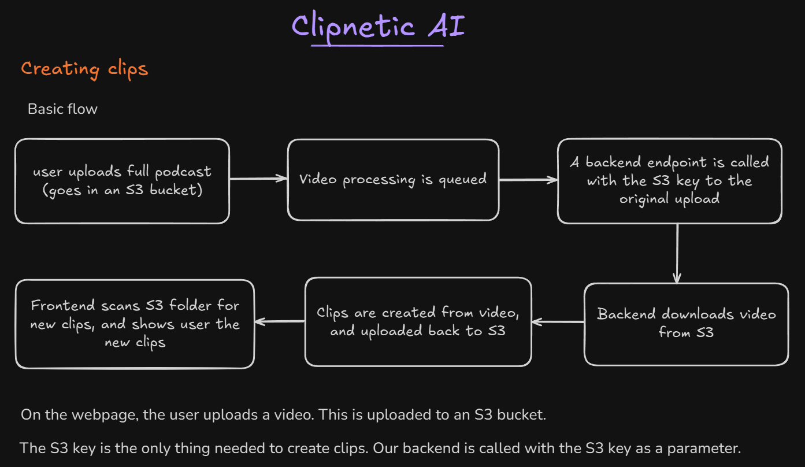

# Clipnetic AI

AI Podcast Clipper SaaS

Clipnetic-AI is an end-to-end SaaS platform that transforms long-form podcast videos into viral short-form clips optimized for platforms like YouTube Shorts and TikTok. Powered by cutting-edge AI models, the app automatically transcribes content, detects high-engagement segments, and intelligently crops the clip to focus on the active speaker.

## Basic Workflow of the Application



---

## Features

- 🎬 Auto-detection of viral moments in podcasts (stories, questions, etc.)
- 🔊 Automatically added subtitles on clips
- 📝 Transcription with m-bain/whisperX
- 🎯 Active speaker detection for video cropping with Junhua-Liao/LR-ASD
- 📱 Clips optimized for vertical platforms (TikTok, YouTube Shorts)
- 🎞️ GPU-accelerated video rendering with FFMPEGCV
- 🧠 LLM-powered viral moment identification with Gemini 2.5 Pro
- 📊 Queue system with Inngest for handling user load
- 💳 Credit-based system
- 💰 Stripe integration for credit pack purchases
- 👤 User authentication system
- 📱 Responsive Next.js web interface
- 🎛️ Dashboard to upload podcasts and see clips
- ⏱️ Inngest for handling long-running processes
- ⚡ Serverless GPU processing with Modal
- 🌐 FastAPI endpoint for podcast processing
- 🎨 Modern UI with Tailwind CSS & Shadcn UI

---

### FFmpeg – media converter

To crop a video, use the following command:

```bash
ffmpeg -ss 00:14:00 -to 00:20:00 -i podcast.mp4 -c copy podcast6min.mp4
```

---

## AWS Setup

### Setup S3 Bucket

- Create a new S3 bucket from [AWS Console](https://console.aws.amazon.com/)

- CORS configuration for S3 bucket

    ```json
    [
        {
            "AllowedHeaders": [
                "Content-Type",
                "Content-Length",
                "Authorization"
            ],
            "AllowedMethods": [
                "PUT"
            ],
            "AllowedOrigins": [
                "*"
            ],
            "ExposeHeaders": [
                "ETag"
            ],
            "MaxAgeSeconds": 3600
        }
    ]
    ```

- You can create a new folder (`/test1`) in that bucket and upload an example video file.

### Setup IAM User

- Create a new User from IAM Dashboard

- Provide User name and then Next

- Attach policies directly > Create policy > Specify permissions in JSON

- IAM user policy to upload, download and list bucket items:

    ```json
    {
        "Version": "2012-10-17",
        "Statement": [
            {
                "Effect": "Allow",
                "Action": [
                    "s3:ListBucket"
                ],
                "Resource": "[S3 ARN here]"
            },
            {
                "Effect": "Allow",
                "Action": [
                    "s3:GetObject",
                    "s3:PutObject"
                ],
                "Resource": "[S3 ARN here]/*"
            }
        ]
    }
    ```

- Refresh and search it, add that policy to the new User

### Create Access Key

- Select that newly created IAM User > Security and Credentials
- Create access key
- Select "Application running outside AWS"
- Copy the "Access key" and "Secret access key"
- Set those two as new secret in **Modal**
  - `AWS_ACCESS_KEY_ID`
  - `AWS_SECRET_ACCESS_KEY`

---

## Setup the Project Locally

Follow these steps to install and set up the project.

### Clone the Repository

```bash
git clone --recurse-submodules https://github.com/SuperSection/Clipnetic-AI.git
```

### Install Python

Download and install Python if not already installed. Refer to the Official [Python Download](https://www.python.org/downloads/) page for guidance on installation.

Create a virtual environment with **Python 3.12**. You can use [`pyenv`](https://github.com/pyenv/pyenv) or [`pyenv-win`](https://github.com/pyenv-win/pyenv-win) to set specific Python version while creating a `.venv`

---

### Backend Setup

1. Navigate to backend folder:

    ```bash
    cd clipnetic-ai-backend
    ```

2. Install dependencies:

    ```bash
    pip install -r requirements.txt
    ```

3. Clone the [LR-ASD](https://github.com/Junhua-Liao/LR-ASD) repo into the backend folder, and rename the folder as `asd`:

    ```bash
    git clone https://github.com/Junhua-Liao/LR-ASD.git asd
    ```

4. Modal setup:

    ```bash
    modal setup
    ```

5. Run on Modal:

    ```bash
    modal run main.py
    ```

6. Deploy backend:

    ```bash
    modal deploy main.py
    ```

---

### Frontend Setup

Install dependencies:

```bash
cd clipnetic-ai-frontend
npm i
```

Run:

```bash
npm run dev
```

---

### Inngest Queue

Run the local queue development server with Inngest:

```bash
cd clipnetic-ai-frontend
npm run inngest-dev
```

Access Inngest Development UI on: <http://localhost:8288>

---

## Author

- [Soumo Sarkar](https://www.linkedin.com/in/soumo-sarkar/)

## Reference

- [Python3 library for downloading YouTube Videos](https://github.com/JuanBindez/pytubefix)
- [FFmpeg](https://ffmpeg.org/download.html)
- [LR-ASD](https://github.com/Junhua-Liao/LR-ASD)
- [WhisperX](https://github.com/m-bain/whisperX)
- [ffmpegcv](https://github.com/chenxinfeng4/ffmpegcv)
- [inngest – Next.js Quick Start](https://www.inngest.com/docs/getting-started/nextjs-quick-start)
- [shadcn/ui – Next.js](https://ui.shadcn.com/docs/installation/next)
- [Favicon Generator](https://favicon.io/)
